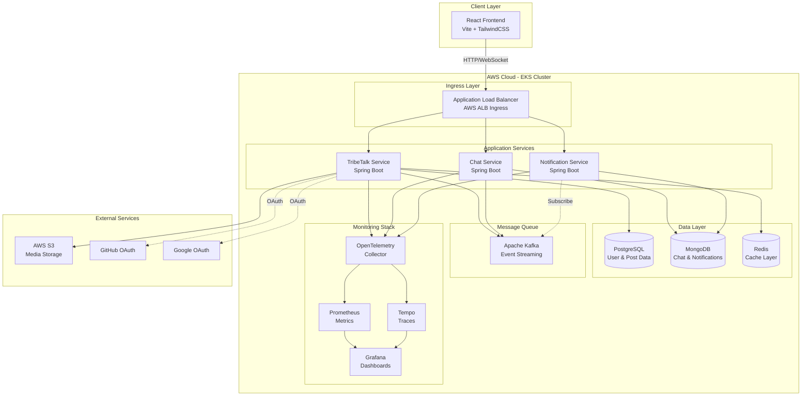
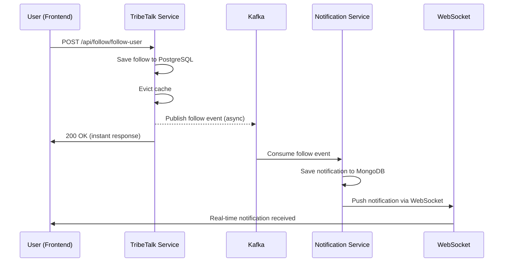
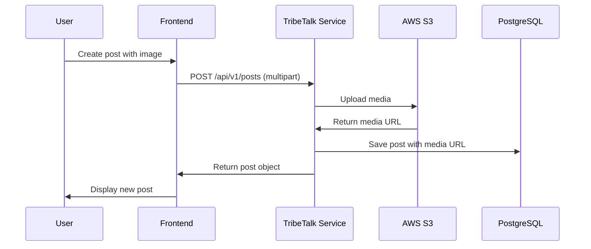

# TribeTalk - Architecture Overview

## 📋 Executive Summary

TribeTalk is a production-grade, cloud-native social media platform built with modern microservices architecture. The application demonstrates enterprise-level design patterns, scalability, and observability while providing Twitter-like functionality including posts, follows, real-time notifications, and messaging.

**Live Application**: http://k8s-default-tribetal-089de13287-2075252521.eu-north-1.elb.amazonaws.com

---

## 🏗️ System Architecture

### High-Level Architecture



---

## 🎯 Core Services

### 1. **TribeTalk Service** (Main Backend)
- **Technology**: Spring Boot 3.5, Java 21
- **Database**: PostgreSQL (User profiles, posts, follows, likes, bookmarks)
- **Cache**: Redis (Session management, frequently accessed data)
- **Responsibilities**:
  - User authentication & authorization (JWT + OAuth2)
  - Post management (CRUD, media uploads to S3)
  - Social graph (follow/unfollow, followers/following)
  - Engagement (likes, bookmarks, replies)
  - Notification event publishing to Kafka

### 2. **Chat Service**
- **Technology**: Spring Boot, WebSocket (STOMP)
- **Database**: MongoDB (Chat messages, conversations)
- **Responsibilities**:
  - Real-time messaging via WebSocket
  - Chat history persistence
  - Message delivery tracking

### 3. **Notification Service**
- **Technology**: Spring Boot, WebSocket
- **Database**: MongoDB (Notification history)
- **Responsibilities**:
  - Kafka consumer for notification events
  - Real-time notification delivery via WebSocket
  - Notification persistence and retrieval

### 4. **Frontend Application**
- **Technology**: React 18, Vite, TailwindCSS v4
- **Features**:
  - Responsive dark/light theme
  - Real-time updates via WebSocket
  - OAuth2 social login
  - Media upload and preview
  - Infinite scroll and lazy loading

---

## 🔄 Key Architectural Patterns

### Microservices Architecture
- **Service Isolation**: Each service has its own database and deployment
- **API Gateway**: ALB routes requests to appropriate services
- **Service Discovery**: Kubernetes DNS for inter-service communication

### Event-Driven Architecture
- **Async Communication**: Kafka for decoupled event processing
- **Event Topics**: `notifications-topic` for follow/like/comment events
- **Idempotent Operations**: Retry logic with exponential backoff

### Caching Strategy
- **Redis Cache**: User profiles, follower counts, following lists
- **Cache Eviction**: Automatic invalidation on data updates
- **TTL Management**: Configurable expiration for different data types

### Observability
- **Distributed Tracing**: OpenTelemetry → Tempo → Grafana
- **Metrics**: Prometheus scraping → Grafana dashboards
- **Logging**: Structured logging with trace correlation
- **Health Checks**: Kubernetes liveness/readiness probes

---

## 🔐 Security Architecture

### Authentication & Authorization
- **JWT Tokens**: Stateless authentication with HTTP-only cookies
- **OAuth2 Integration**: GitHub and Google social login
- **Role-Based Access**: USER role with Spring Security
- **CORS Configuration**: Restricted to frontend origin

### Data Security
- **Secrets Management**: Kubernetes secrets for sensitive data
- **Environment Variables**: All configuration externalized
- **Database Encryption**: PostgreSQL and MongoDB encryption at rest
- **S3 Security**: IAM roles for secure media uploads

---

## 📊 Data Flow Examples

### Follow Notification Flow



### Post Creation with Media



---

## 🚀 Deployment Architecture

### Kubernetes Infrastructure
- **Cluster**: AWS EKS (Elastic Kubernetes Service)
- **Nodes**: 3 worker nodes across availability zones
- **Ingress**: AWS ALB Ingress Controller
- **Storage**: EBS volumes for persistent data

### Service Deployment
```yaml
Services:
  - tribetalk: 1 replica (512Mi memory, 200m CPU)
  - chatservice: 1 replica (384Mi memory, 200m CPU)
  - notification-service: 1 replica (256Mi memory, 100m CPU)
  - tribe-talk-frontend: 1 replica (128Mi memory, 50m CPU)
  
Databases:
  - PostgreSQL: StatefulSet with persistent volume
  - MongoDB: StatefulSet with persistent volume
  - Redis: Deployment with ephemeral storage
  - Kafka: StatefulSet (3 replicas for HA)
```

### CI/CD Pipeline
- **Build**: Maven for backend, npm for frontend
- **Containerization**: Multi-stage Docker builds
- **Registry**: AWS ECR (Elastic Container Registry)
- **Deployment**: kubectl apply with rolling updates

---

## 📈 Performance Optimizations

### Backend Optimizations
1. **Async Notifications**: `@Async` execution prevents blocking
2. **Connection Pooling**: HikariCP for database connections
3. **Lazy Loading**: JPA fetch strategies optimized
4. **Batch Operations**: Bulk inserts for efficiency
5. **Kafka Producer**: Non-blocking async sends

### Frontend Optimizations
1. **Code Splitting**: Vite dynamic imports
2. **Lazy Loading**: React.lazy for route-based splitting
3. **Image Optimization**: WebP format, lazy loading
4. **Caching**: Service worker for static assets
5. **Bundle Size**: Tree shaking and minification

### Database Optimizations
1. **Indexes**: Composite indexes on frequently queried columns
2. **Query Optimization**: N+1 query prevention
3. **Connection Pooling**: Configured for optimal throughput
4. **Read Replicas**: Planned for scaling reads

---

## 🔧 Technology Stack Summary

| Layer | Technology | Purpose |
|-------|-----------|---------|
| **Frontend** | React 18, Vite, TailwindCSS v4 | Modern, responsive UI |
| **Backend** | Spring Boot 3.5, Java 21 | Microservices framework |
| **Databases** | PostgreSQL, MongoDB, Redis | Polyglot persistence |
| **Messaging** | Apache Kafka | Event streaming |
| **Cache** | Redis | Session & data caching |
| **Storage** | AWS S3 | Media file storage |
| **Observability** | Grafana, Prometheus, Tempo, OpenTelemetry | Monitoring & tracing |
| **Container** | Docker, Kubernetes (EKS) | Orchestration |
| **Cloud** | AWS (EKS, ALB, S3, ECR) | Infrastructure |
| **Auth** | JWT, OAuth2 (GitHub, Google) | Authentication |

---

## 🎓 Key Learnings & Best Practices

### Microservices Design
- ✅ Single Responsibility Principle per service
- ✅ Database per service pattern
- ✅ API versioning for backward compatibility
- ✅ Circuit breakers for resilience (planned)

### Event-Driven Architecture
- ✅ Async processing for non-critical operations
- ✅ Idempotent event handlers
- ✅ Dead letter queues for failed events (planned)

### Cloud-Native Patterns
- ✅ 12-Factor App principles
- ✅ Externalized configuration
- ✅ Health checks and graceful shutdown
- ✅ Horizontal scaling capability

### Observability
- ✅ Distributed tracing with correlation IDs
- ✅ Structured logging with context
- ✅ Custom metrics for business KPIs
- ✅ Centralized monitoring dashboards

---

## 🔮 Future Enhancements

1. **Scalability**
   - Horizontal pod autoscaling (HPA)
   - Database read replicas
   - CDN for static assets

2. **Features**
   - Direct messaging groups
   - Video upload support
   - Advanced search with Elasticsearch
   - Trending topics algorithm

3. **Reliability**
   - Circuit breakers with Resilience4j
   - Rate limiting per user
   - Backup and disaster recovery
   - Multi-region deployment

4. **Security**
   - API rate limiting
   - DDoS protection
   - Content moderation AI
   - Two-factor authentication

---

## 📞 Application Access

- **Live URL**: http://k8s-default-tribetal-089de13287-2075252521.eu-north-1.elb.amazonaws.com
- **Grafana**: Port-forward to `monitoring-grafana` service
- **Prometheus**: Accessible via Grafana data source

---

## 👥 Team & Acknowledgments

Built with modern cloud-native technologies and enterprise best practices, TribeTalk demonstrates a production-ready social media platform with scalability, observability, and maintainability at its core.

**Tech Stack Highlights**: Spring Boot 3.5, React 18, Kubernetes, Kafka, PostgreSQL, MongoDB, Redis, AWS, OpenTelemetry
