# TribeTalk - Complete Architecture Diagram

## Comprehensive System Architecture with Technologies

```mermaid
graph TB
    subgraph "Client Layer"
        USER[👤 End Users]
        BROWSER[🌐 Web Browser]
    end
    
    subgraph "Frontend - React Application"
        FE["⚛️ React 18 Frontend<br/>━━━━━━━━━━━━━━<br/>📦 Vite Build Tool<br/>🎨 TailwindCSS v4<br/>🔌 WebSocket Client<br/>📡 Axios HTTP Client"]
    end
    
    subgraph "AWS Cloud Infrastructure"
        subgraph "Internet Gateway"
            IGW[🌍 Internet Gateway]
        end
        
        subgraph "Public Subnets - eu-north-1a/1b"
            ALB["⚖️ Application Load Balancer<br/>━━━━━━━━━━━━━━<br/>AWS ALB Ingress Controller<br/>HTTP/HTTPS Routing<br/>Health Checks"]
            BASTION["🔐 Bastion Host<br/>━━━━━━━━━━━━━━<br/>Ubuntu 22.04<br/>SSH Jump Server<br/>IP: 13.61.144.161"]
            JENKINS["🔧 Jenkins CI/CD<br/>━━━━━━━━━━━━━━<br/>Pipeline Automation<br/>Docker Build<br/>IP: 13.62.109.54"]
            MONITORING["📊 Monitoring Stack<br/>━━━━━━━━━━━━━━<br/>IP: 13.49.177.7"]
        end
        
        subgraph "Private Subnets - eu-north-1a/1b"
            subgraph "EKS Cluster - tribetalk-eks"
                subgraph "Application Pods"
                    TS["🚀 TribeTalk Service<br/>━━━━━━━━━━━━━━<br/>Spring Boot 3.5<br/>Java 21<br/>Port: 8080<br/>━━━━━━━━━━━━━━<br/>Features:<br/>• JWT Auth<br/>• OAuth2 (GitHub/Google)<br/>• REST API<br/>• Async Processing"]
                    
                    CS["💬 Chat Service<br/>━━━━━━━━━━━━━━<br/>Spring Boot 3.5<br/>Java 21<br/>Port: 8081<br/>━━━━━━━━━━━━━━<br/>Features:<br/>• WebSocket (STOMP)<br/>• Real-time Messaging<br/>• Message Persistence"]
                    
                    NS["🔔 Notification Service<br/>━━━━━━━━━━━━━━<br/>Spring Boot 3.5<br/>Java 21<br/>Port: 8082<br/>━━━━━━━━━━━━━━<br/>Features:<br/>• Kafka Consumer<br/>• WebSocket Push<br/>• Event Processing"]
                    
                    FE_POD["🎨 Frontend Pod<br/>━━━━━━━━━━━━━━<br/>Nginx<br/>Port: 80<br/>Serves React SPA"]
                end
                
                subgraph "Kubernetes Services"
                    K8S_SVC["☸️ Kubernetes Services<br/>━━━━━━━━━━━━━━<br/>ClusterIP Services<br/>Service Discovery<br/>Load Balancing"]
                end
            end
            
            subgraph "Database Layer - EC2 Instances"
                PG["🐘 PostgreSQL 15<br/>━━━━━━━━━━━━━━<br/>IP: 10.0.10.59<br/>Port: 5432<br/>━━━━━━━━━━━━━━<br/>Storage:<br/>• EBS gp3 30GB<br/>• /var/lib/postgresql<br/>━━━━━━━━━━━━━━<br/>Data:<br/>• Users & Auth<br/>• Posts & Likes<br/>• Follows & Bookmarks<br/>• Refresh Tokens"]
                
                MG["🍃 MongoDB 7.0<br/>━━━━━━━━━━━━━━<br/>IP: 10.0.10.124<br/>Port: 27017<br/>━━━━━━━━━━━━━━<br/>Storage:<br/>• EBS gp3 30GB<br/>• /var/lib/mongodb<br/>━━━━━━━━━━━━━━<br/>Data:<br/>• Chat Messages<br/>• User Profiles<br/>• Notifications<br/>• Posts (NoSQL)"]
                
                RD["⚡ Redis 7.x<br/>━━━━━━━━━━━━━━<br/>IP: 10.0.10.49<br/>Port: 6379<br/>━━━━━━━━━━━━━━<br/>Storage:<br/>• EBS gp3 30GB<br/>• /var/lib/redis<br/>━━━━━━━━━━━━━━<br/>Cache:<br/>• Session Data<br/>• User Profiles<br/>• Follower Counts<br/>• Following Lists"]
                
                KF["📨 Apache Kafka 3.6.1<br/>━━━━━━━━━━━━━━<br/>IP: 10.0.10.205<br/>Port: 9092<br/>━━━━━━━━━━━━━━<br/>Storage:<br/>• EBS gp3 30GB<br/>• /var/lib/kafka<br/>━━━━━━━━━━━━━━<br/>Topics:<br/>• notifications-topic<br/>• KRaft Mode (No Zookeeper)"]
            end
        end
        
        subgraph "Monitoring Infrastructure"
            GRAFANA["📊 Grafana<br/>━━━━━━━━━━━━━━<br/>Dashboards<br/>Visualization<br/>Port: 3000"]
            
            PROMETHEUS["📈 Prometheus<br/>━━━━━━━━━━━━━━<br/>Metrics Collection<br/>Time Series DB<br/>Port: 9090"]
            
            TEMPO["🔍 Grafana Tempo<br/>━━━━━━━━━━━━━━<br/>Distributed Tracing<br/>Trace Storage"]
            
            OTEL["📡 OpenTelemetry<br/>━━━━━━━━━━━━━━<br/>Collector<br/>Traces & Metrics<br/>Port: 4317/4318"]
        end
        
        subgraph "AWS Managed Services"
            ECR["📦 Amazon ECR<br/>━━━━━━━━━━━━━━<br/>Docker Registry<br/>━━━━━━━━━━━━━━<br/>Images:<br/>• tribetalk-service<br/>• chatservice<br/>• notification-service<br/>• frontend"]
            
            S3["🪣 Amazon S3<br/>━━━━━━━━━━━━━━<br/>Object Storage<br/>━━━━━━━━━━━━━━<br/>Buckets:<br/>• Media Files<br/>• Database Backups<br/>• Static Assets"]
            
            SECRETS["🔐 AWS Secrets Manager<br/>━━━━━━━━━━━━━━<br/>Secrets:<br/>• tribetalk/database/credentials<br/>• tribetalk/app/config<br/>━━━━━━━━━━━━━━<br/>External Secrets Operator<br/>→ K8s Secrets Sync"]
            
            IAM["👤 AWS IAM<br/>━━━━━━━━━━━━━━<br/>Roles & Policies<br/>IRSA for EKS<br/>EC2 Instance Profiles"]
        end
        
        subgraph "Security Groups"
            SG["🛡️ Security Groups<br/>━━━━━━━━━━━━━━<br/>• ALB SG<br/>• EKS Node SG<br/>• Database SGs<br/>• Bastion SG"]
        end
    end
    
    subgraph "External Services"
        GITHUB["🐙 GitHub OAuth<br/>━━━━━━━━━━━━━━<br/>Social Login<br/>OAuth2 Provider"]
        
        GOOGLE["🔍 Google OAuth<br/>━━━━━━━━━━━━━━<br/>Social Login<br/>OAuth2 Provider"]
    end
    
    subgraph "Development Tools"
        TERRAFORM["🏗️ Terraform<br/>━━━━━━━━━━━━━━<br/>Infrastructure as Code<br/>AWS Provider<br/>State Management"]
        
        ANSIBLE["⚙️ Ansible<br/>━━━━━━━━━━━━━━<br/>Configuration Mgmt<br/>Database Setup<br/>Service Installation"]
        
        DOCKER["🐳 Docker<br/>━━━━━━━━━━━━━━<br/>Containerization<br/>Multi-stage Builds<br/>Image Optimization"]
        
        MAVEN["📦 Maven<br/>━━━━━━━━━━━━━━<br/>Build Tool<br/>Dependency Mgmt<br/>Spring Boot Plugin"]
    end
    
    %% User Flow
    USER --> BROWSER
    BROWSER --> FE
    
    %% Frontend to Backend
    FE -->|HTTP/WS| IGW
    IGW --> ALB
    ALB -->|/| FE_POD
    ALB -->|/api| TS
    ALB -->|/api/chat, /ws| CS
    ALB -->|/notification| NS
    ALB -->|/grafana| GRAFANA
    
    %% Service to Database Connections
    TS -->|JDBC| PG
    TS -->|Lettuce| RD
    TS -->|Spring Kafka| KF
    TS -->|AWS SDK| S3
    
    CS -->|Spring Data| MG
    CS -->|Spring Kafka| KF
    
    NS -->|Spring Data| MG
    NS -->|Kafka Consumer| KF
    
    %% OAuth Flow
    TS -.->|OAuth2| GITHUB
    TS -.->|OAuth2| GOOGLE
    
    %% Secrets Management
    SECRETS -->|External Secrets| K8S_SVC
    K8S_SVC -->|Env Vars| TS
    K8S_SVC -->|Env Vars| CS
    K8S_SVC -->|Env Vars| NS
    
    %% Monitoring Flow
    TS -->|Traces/Metrics| OTEL
    CS -->|Traces/Metrics| OTEL
    NS -->|Traces/Metrics| OTEL
    
    OTEL --> PROMETHEUS
    OTEL --> TEMPO
    PROMETHEUS --> GRAFANA
    TEMPO --> GRAFANA
    
    %% CI/CD Flow
    JENKINS -->|Build & Push| ECR
    ECR -->|Pull Images| K8S_SVC
    
    %% Infrastructure Management
    TERRAFORM -.->|Provision| ALB
    TERRAFORM -.->|Provision| PG
    TERRAFORM -.->|Provision| MG
    TERRAFORM -.->|Provision| RD
    TERRAFORM -.->|Provision| KF
    TERRAFORM -.->|Provision| BASTION
    
    ANSIBLE -.->|Configure| PG
    ANSIBLE -.->|Configure| MG
    ANSIBLE -.->|Configure| RD
    ANSIBLE -.->|Configure| KF
    
    %% Bastion Access
    BASTION -.->|SSH| PG
    BASTION -.->|SSH| MG
    BASTION -.->|SSH| RD
    BASTION -.->|SSH| KF
    
    %% Backup Flow
    PG -.->|Backups| S3
    MG -.->|Backups| S3
    
    %% Security
    SG -.->|Protect| PG
    SG -.->|Protect| MG
    SG -.->|Protect| RD
    SG -.->|Protect| KF
    SG -.->|Protect| ALB
    
    IAM -.->|Authorize| TS
    IAM -.->|Authorize| ECR
    IAM -.->|Authorize| S3
    
    classDef frontend fill:#61dafb,stroke:#333,stroke-width:2px,color:#000
    classDef backend fill:#6db33f,stroke:#333,stroke-width:2px,color:#000
    classDef database fill:#336791,stroke:#333,stroke-width:2px,color:#fff
    classDef messaging fill:#231f20,stroke:#333,stroke-width:2px,color:#fff
    classDef monitoring fill:#f46800,stroke:#333,stroke-width:2px,color:#fff
    classDef aws fill:#ff9900,stroke:#333,stroke-width:2px,color:#000
    classDef external fill:#4285f4,stroke:#333,stroke-width:2px,color:#fff
    classDef tools fill:#326ce5,stroke:#333,stroke-width:2px,color:#fff
    
    class FE,FE_POD,BROWSER frontend
    class TS,CS,NS backend
    class PG,MG,RD database
    class KF messaging
    class GRAFANA,PROMETHEUS,TEMPO,OTEL monitoring
    class ALB,ECR,S3,SECRETS,IAM,SG aws
    class GITHUB,GOOGLE external
    class TERRAFORM,ANSIBLE,DOCKER,MAVEN,JENKINS tools
```

## Technology Stack Summary

### Frontend Stack
- **Framework**: React 18
- **Build Tool**: Vite
- **Styling**: TailwindCSS v4
- **HTTP Client**: Axios
- **WebSocket**: STOMP over WebSocket
- **State Management**: React Context API
- **Routing**: React Router v6

### Backend Stack
- **Framework**: Spring Boot 3.5
- **Language**: Java 21
- **Security**: Spring Security + JWT + OAuth2
- **Data Access**: Spring Data JPA, Spring Data MongoDB
- **Messaging**: Spring Kafka
- **WebSocket**: Spring WebSocket (STOMP)
- **Caching**: Spring Data Redis (Lettuce)
- **Observability**: OpenTelemetry, Micrometer

### Database Stack
- **Relational**: PostgreSQL 15
- **NoSQL**: MongoDB 7.0
- **Cache**: Redis 7.x
- **Message Queue**: Apache Kafka 3.6.1 (KRaft mode)

### Cloud Infrastructure
- **Container Orchestration**: Kubernetes (AWS EKS)
- **Load Balancer**: AWS Application Load Balancer
- **Container Registry**: Amazon ECR
- **Object Storage**: Amazon S3
- **Secrets**: AWS Secrets Manager + External Secrets Operator
- **Compute**: EC2 instances (t3.medium)
- **Storage**: EBS gp3 volumes (30GB each)
- **Networking**: VPC, Subnets, Security Groups, Internet Gateway

### Monitoring Stack
- **Dashboards**: Grafana
- **Metrics**: Prometheus
- **Tracing**: Grafana Tempo
- **Collector**: OpenTelemetry Collector
- **Instrumentation**: OpenTelemetry Java Agent

### DevOps Tools
- **IaC**: Terraform (AWS Provider)
- **Configuration**: Ansible
- **CI/CD**: Jenkins
- **Containerization**: Docker (Multi-stage builds)
- **Build Tools**: Maven (Backend), npm/Vite (Frontend)
- **Version Control**: Git

### Security & Authentication
- **Authentication**: JWT tokens (HTTP-only cookies)
- **OAuth2 Providers**: GitHub, Google
- **Authorization**: Spring Security (Role-based)
- **Secrets Management**: AWS Secrets Manager
- **Network Security**: Security Groups, Private Subnets
- **Access Control**: Bastion host for SSH

### Data Persistence
- **Storage**: EBS gp3 volumes (3,000 IOPS, 125 MB/s)
- **Backup**: Automated scripts to S3
- **Retention**: 30-day lifecycle policy
- **Recovery**: Point-in-time restore from backups

## Key Architectural Patterns

1. **Microservices Architecture**: Service isolation with dedicated databases
2. **Event-Driven**: Kafka for async communication
3. **Polyglot Persistence**: PostgreSQL + MongoDB + Redis
4. **Cloud-Native**: 12-factor app, containerized, orchestrated
5. **Observability**: Distributed tracing, metrics, structured logging
6. **Security**: OAuth2, JWT, secrets management, network isolation
7. **Scalability**: Horizontal scaling, caching, async processing
8. **Resilience**: Health checks, graceful shutdown, retry logic
