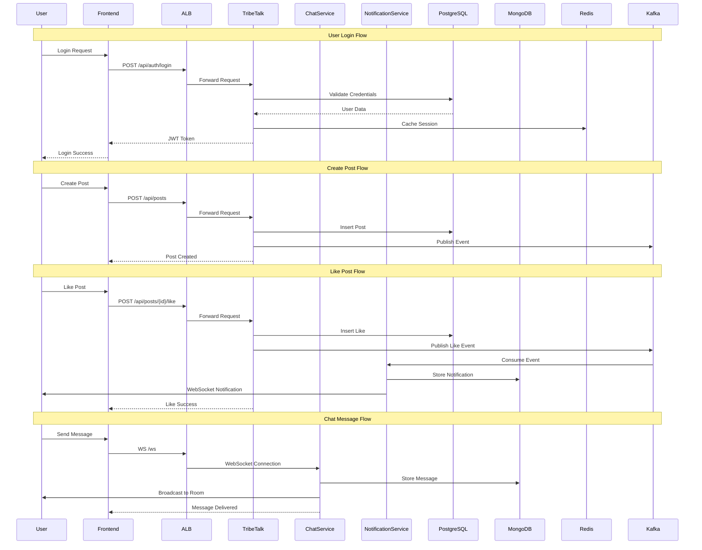
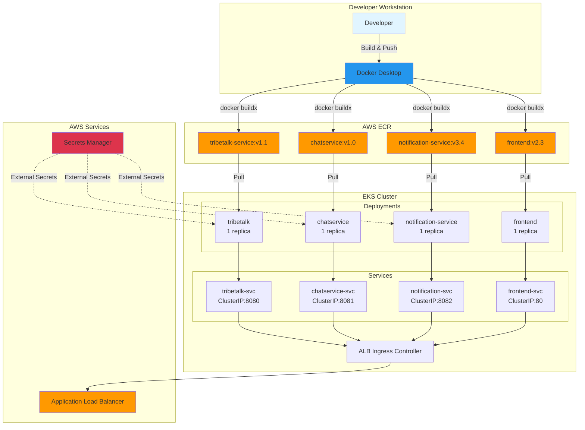
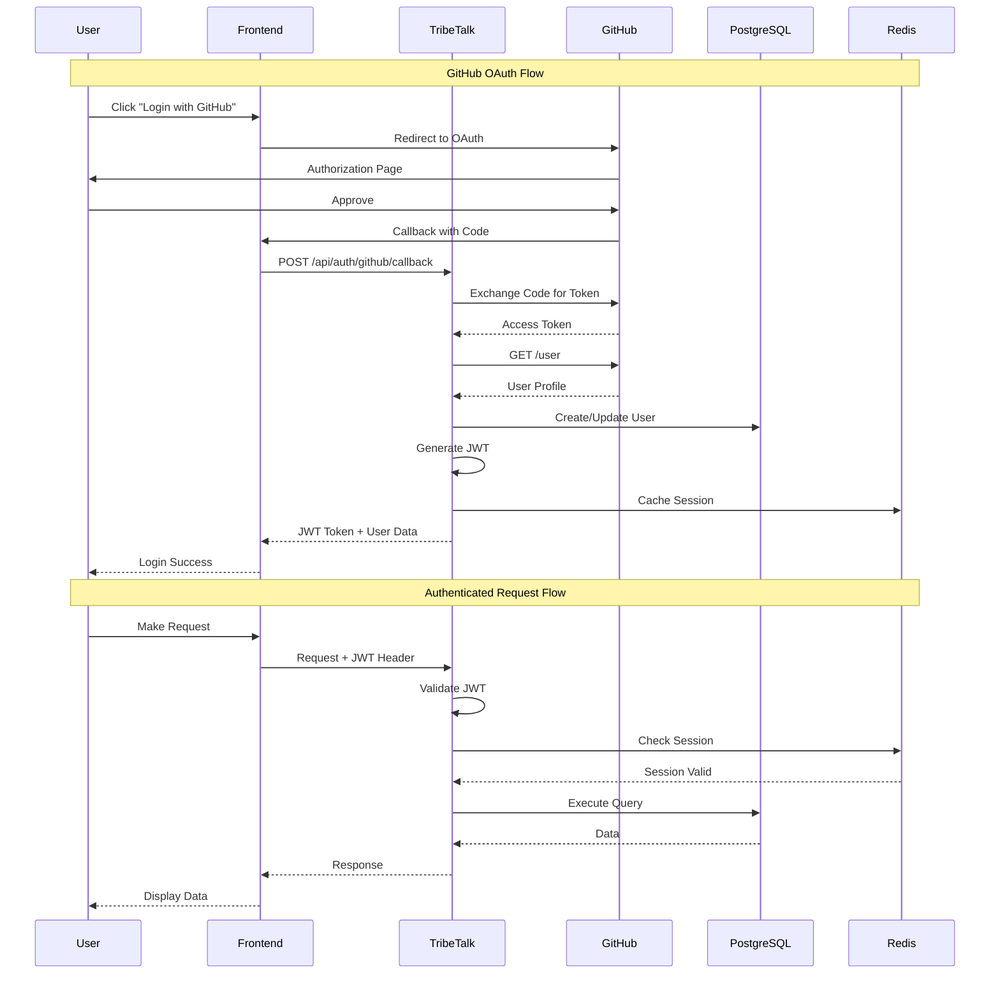
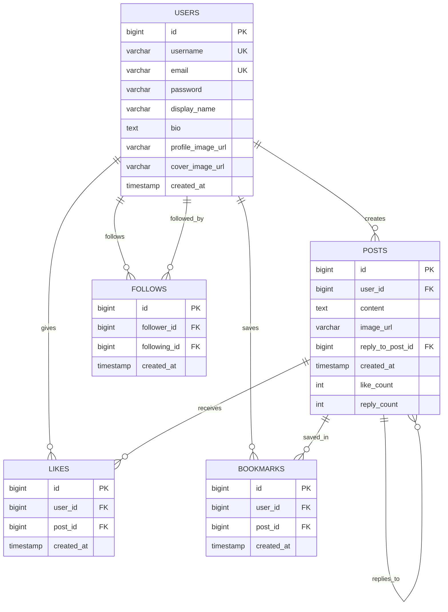
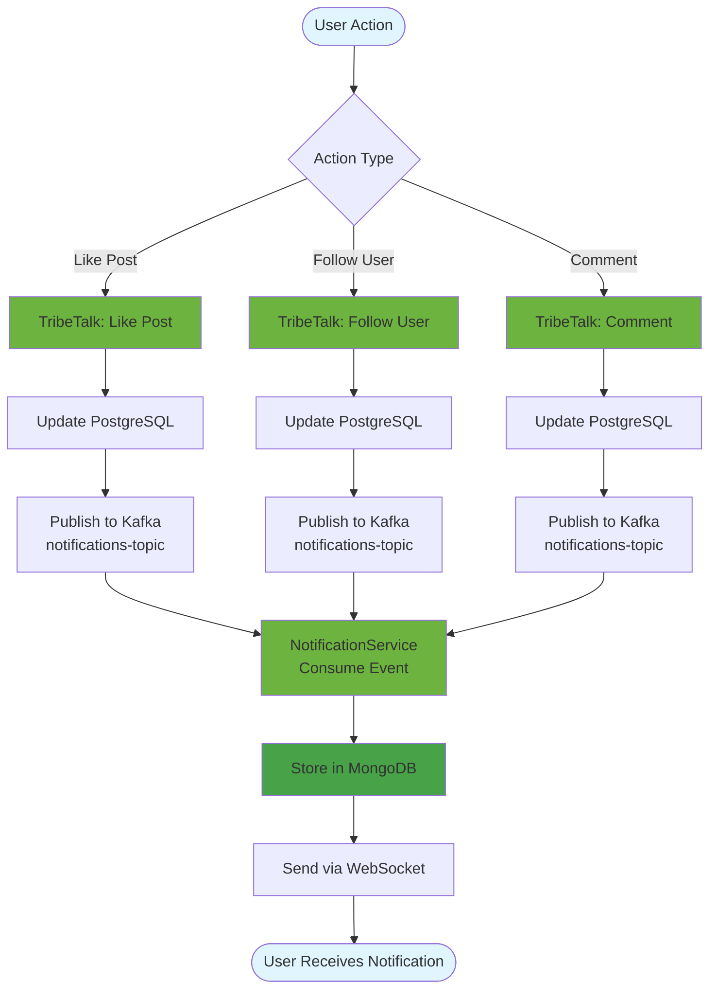
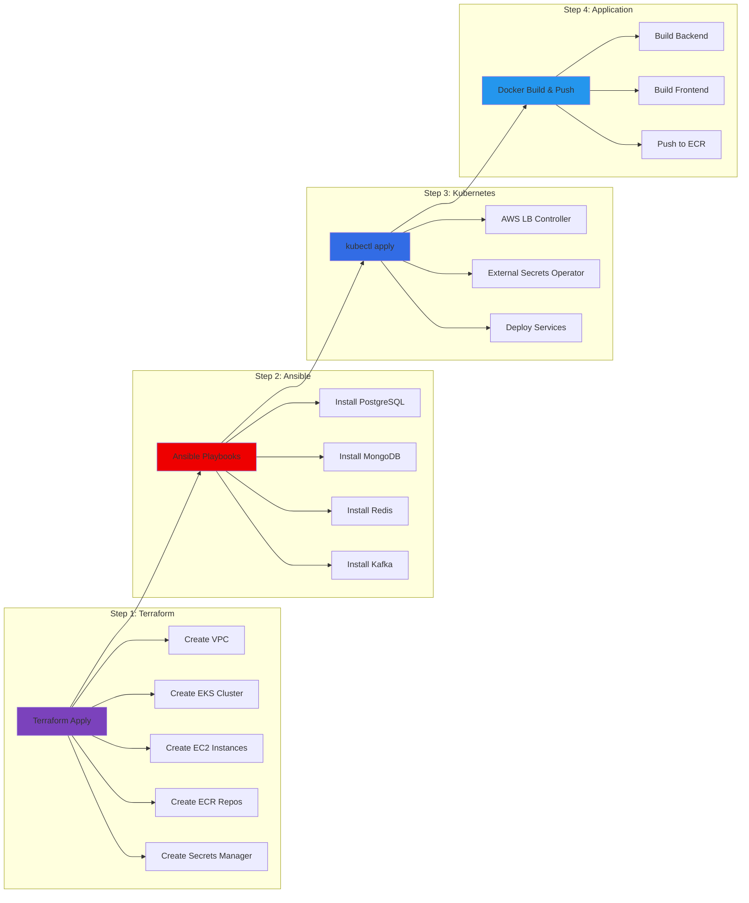
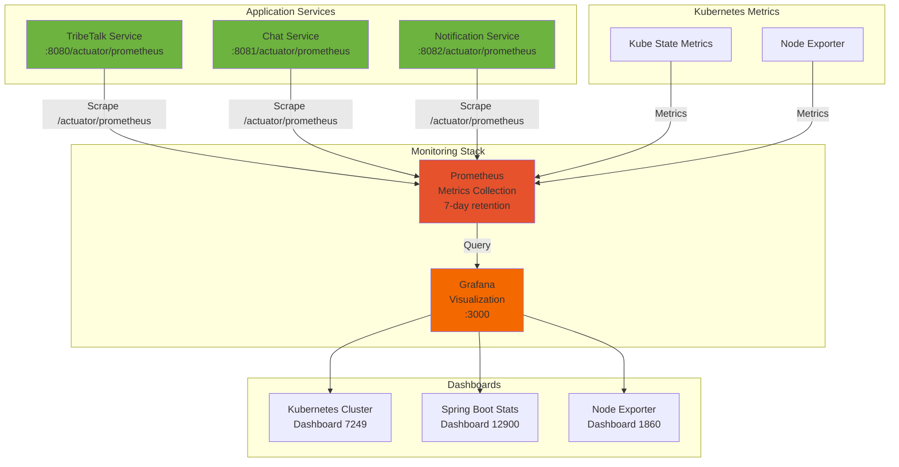

# TribeTalk Architecture - Mermaid Diagrams

This file contains Mermaid diagram scripts for visualizing the TribeTalk architecture. These diagrams can be rendered in GitHub, GitLab, or any Mermaid-compatible viewer.

---

## 1. High-Level System Architecture

```mermaid
graph TB
    subgraph "User Layer"
        User[👤 User Browser]
    end
    
    subgraph "AWS Cloud - eu-north-1"
        subgraph "Load Balancer"
            ALB[AWS Application Load Balancer<br/>k8s-default-tribetal-089de13287-...]
        end
        
        subgraph "EKS Cluster - Kubernetes 1.31"
            subgraph "Application Layer"
                Frontend[React Frontend<br/>Nginx:80<br/>v2.3-feather-icons]
                TribeTalk[TribeTalk Service<br/>Spring Boot:8080<br/>v1.1]
                ChatService[Chat Service<br/>Spring Boot:8081<br/>v1.0]
                NotificationService[Notification Service<br/>Spring Boot:8082<br/>v3.4-bulk-update]
            end
            
            subgraph "Monitoring"
                Grafana[Grafana<br/>v12.3.0]
            end
            
            subgraph "Node Pool"
                Node1[t3.small Node 1<br/>2 vCPU, 2GB RAM]
                Node2[t3.small Node 2<br/>2 vCPU, 2GB RAM]
                Node3[t3.small Node 3<br/>2 vCPU, 2GB RAM]
            end
        end
        
        subgraph "Database Infrastructure - EC2 t3.medium"
            PostgreSQL[(PostgreSQL 15<br/>Port 5432<br/>tribetalk DB)]
            MongoDB[(MongoDB 7.0<br/>Port 27017<br/>tribetalknosqldb)]
            Redis[(Redis 7.2<br/>Port 6379<br/>Cache)]
            Kafka[Apache Kafka<br/>KRaft Mode<br/>Port 9092]
        end
        
        subgraph "Supporting Services"
            ECR[AWS ECR<br/>Container Registry]
            SecretsManager[AWS Secrets Manager<br/>Credentials]
            ExternalSecrets[External Secrets Operator]
        end
    end
    
    User -->|HTTPS| ALB
    ALB -->|/| Frontend
    ALB -->|/api/*| TribeTalk
    ALB -->|/ws| ChatService
    ALB -->|/notification/*| NotificationService
    
    Frontend -.->|API Calls| TribeTalk
    Frontend -.->|WebSocket| ChatService
    Frontend -.->|WebSocket| NotificationService
    
    TribeTalk -->|Read/Write| PostgreSQL
    TribeTalk -->|Cache| Redis
    TribeTalk -->|Publish Events| Kafka
    
    ChatService -->|Store Messages| MongoDB
    
    NotificationService -->|Consume Events| Kafka
    NotificationService -->|Store Notifications| MongoDB
    
    Grafana -.->|Monitor| TribeTalk
    Grafana -.->|Monitor| ChatService
    Grafana -.->|Monitor| NotificationService
    
    ExternalSecrets -->|Sync Secrets| SecretsManager
    
    style User fill:#e1f5ff
    style ALB fill:#ff9900
    style Frontend fill:#61dafb
    style TribeTalk fill:#6db33f
    style ChatService fill:#6db33f
    style NotificationService fill:#6db33f
    style PostgreSQL fill:#336791
    style MongoDB fill:#47a248
    style Redis fill:#dc382d
    style Kafka fill:#231f20
    style Grafana fill:#f46800
```



### Key Points to Explain:

**Infrastructure Layers:**
- **User Layer**: Web browsers accessing the application via HTTPS
- **Load Balancer**: AWS ALB distributes traffic across services
- **EKS Cluster**: Kubernetes 1.31 running on 3x t3.small nodes (6 vCPU, 6GB RAM total)
- **Database Layer**: Separate EC2 instance hosting all databases

**Application Services:**
- **Frontend** (React + Nginx): Serves the UI on port 80
- **TribeTalk Service** (Spring Boot): Main API on port 8080 - handles users, posts, authentication
- **ChatService** (Spring Boot): Real-time messaging on port 8081 via WebSocket
- **NotificationService** (Spring Boot): Event-driven notifications on port 8082

**Data Storage:**
- **PostgreSQL**: Relational data (users, posts, likes, follows)
- **MongoDB**: NoSQL data (messages, notifications)
- **Redis**: Caching layer for sessions and frequently accessed data
- **Kafka**: Event streaming for asynchronous notifications

**Request Routing:**
- `/` → Frontend (React SPA)
- `/api/*` → TribeTalk Service
- `/ws` → ChatService (WebSocket)
- `/notification/*` → NotificationService

**Supporting Services:**
- **Grafana**: Monitoring and visualization (v12.3.0)
- **AWS ECR**: Container image registry
- **AWS Secrets Manager**: Secure credential storage
- **External Secrets Operator**: Syncs secrets from AWS to Kubernetes

---

## 2. Microservices Communication Flow



### Key Points to Explain:

**User Login Flow:**
- User submits credentials → TribeTalk validates against PostgreSQL
- JWT token generated and cached in Redis for fast validation
- Token returned to frontend for subsequent authenticated requests

**Create Post Flow:**
- User creates post → TribeTalk stores in PostgreSQL
- Event published to Kafka for potential notifications
- Post immediately available to other users

**Like Post Flow (Event-Driven):**
- User likes post → TribeTalk updates PostgreSQL
- Like event published to Kafka topic
- NotificationService consumes event asynchronously
- Notification stored in MongoDB and sent via WebSocket to post owner
- Real-time notification appears in user's UI

**Chat Message Flow (Real-time):**
- User sends message via WebSocket (STOMP over SockJS)
- ChatService stores message in MongoDB
- Message broadcast to all users in the chat room
- Instant delivery without polling

**Key Patterns:**
- **Synchronous**: Login, Create Post (immediate response needed)
- **Asynchronous**: Notifications (can be delayed, event-driven)
- **Real-time**: Chat messages (WebSocket for instant delivery)

---

## 3. Data Flow Architecture

```mermaid
flowchart LR
    subgraph "Client"
        Browser[Web Browser]
    end
    
    subgraph "API Gateway"
        ALB[AWS ALB]
    end
    
    subgraph "Application Services"
        Frontend[Frontend<br/>React SPA]
        TribeTalk[TribeTalk<br/>Main API]
        Chat[ChatService<br/>Messaging]
        Notification[NotificationService<br/>Alerts]
    end
    
    subgraph "Data Layer"
        direction TB
        PG[(PostgreSQL<br/>Users, Posts)]
        Mongo[(MongoDB<br/>Messages, Notifications)]
        RedisCache[(Redis<br/>Cache)]
    end
    
    subgraph "Event Streaming"
        Kafka[Kafka<br/>Event Bus]
    end
    
    Browser -->|HTTP/WS| ALB
    ALB --> Frontend
    ALB --> TribeTalk
    ALB --> Chat
    ALB --> Notification
    
    TribeTalk -->|CRUD| PG
    TribeTalk -->|Cache| RedisCache
    TribeTalk -->|Publish| Kafka
    
    Chat -->|Store| Mongo
    
    Notification -->|Consume| Kafka
    Notification -->|Store| Mongo
    
    style Browser fill:#e1f5ff
    style ALB fill:#ff9900
    style Frontend fill:#61dafb
    style TribeTalk fill:#6db33f
    style Chat fill:#6db33f
    style Notification fill:#6db33f
    style PG fill:#336791
    style Mongo fill:#47a248
    style RedisCache fill:#dc382d
    style Kafka fill:#231f20
```



### Key Points to Explain:

**Data Flow Layers:**
- **Client Layer**: Web browsers making HTTP/WebSocket requests
- **API Gateway**: AWS ALB routing traffic to appropriate services
- **Application Layer**: 4 microservices handling different responsibilities
- **Data Layer**: Polyglot persistence (PostgreSQL + MongoDB + Redis)
- **Event Layer**: Kafka for asynchronous event streaming

**Service Responsibilities:**
- **Frontend**: User interface, client-side routing, WebSocket connections
- **TribeTalk**: Main business logic (users, posts, authentication)
- **ChatService**: Real-time messaging with WebSocket
- **NotificationService**: Event consumption and notification delivery

**Data Storage Strategy:**
- **PostgreSQL**: Structured data requiring ACID transactions (users, posts, relationships)
- **MongoDB**: Flexible schema for messages and notifications
- **Redis**: High-speed cache for sessions and frequently accessed data
- **Kafka**: Durable event log for asynchronous processing

**Communication Patterns:**
- **HTTP REST**: Synchronous request/response (Frontend ↔ TribeTalk)
- **WebSocket**: Bidirectional real-time communication (Chat, Notifications)
- **Event Streaming**: Asynchronous pub/sub (TribeTalk → Kafka → NotificationService)

---

## 4. Deployment Architecture



### Key Points to Explain:

**Development Workflow:**
1. **Developer** writes code locally
2. **Docker Desktop** builds multi-platform images (linux/amd64)
3. **AWS ECR** stores container images with version tags
4. **Kubernetes** pulls images and creates deployments

**Container Registry (ECR):**
- Separate repository for each service
- Version tagging (v1.1, v2.3-feather-icons, v3.4-bulk-update)
- Automatic image scanning for vulnerabilities

**Kubernetes Resources:**
- **Deployments**: Manage pod replicas and rolling updates
- **Services**: ClusterIP for internal service discovery
- **Ingress**: ALB controller creates AWS Load Balancer

**Secrets Management:**
- **AWS Secrets Manager**: Central secret storage
- **External Secrets Operator**: Syncs secrets to Kubernetes
- **Automatic Injection**: Secrets mounted as environment variables

**Deployment Process:**
```bash
# Build and push
docker buildx build --platform linux/amd64 -t <ECR_URL>:v1.2 --push .

# Update deployment
kubectl set image deployment/tribetalk tribetalk=<ECR_URL>:v1.2

# Monitor rollout
kubectl rollout status deployment/tribetalk
```

**Benefits:**
- Zero-downtime deployments (rolling updates)
- Easy rollback to previous versions
- Consistent environment (dev = prod)

---

## 5. Authentication & Authorization Flow



### Key Points to Explain:

**GitHub OAuth Flow (Social Login):**
1. User clicks "Login with GitHub" → Redirected to GitHub
2. User approves → GitHub returns authorization code
3. TribeTalk exchanges code for access token
4. TribeTalk fetches user profile from GitHub API
5. User created/updated in PostgreSQL
6. JWT token generated and session cached in Redis
7. User logged in with JWT token

**JWT Token Authentication:**
- **Token Structure**: Header + Payload (userId, username, roles) + Signature
- **Expiry**: 24 hours
- **Storage**: Frontend stores in localStorage/cookie
- **Validation**: Every request verified by Spring Security

**Authenticated Request Flow:**
1. Frontend sends request with `Authorization: Bearer <JWT>` header
2. TribeTalk validates JWT signature and expiry
3. Session checked in Redis for additional validation
4. User data extracted from token
5. Request processed with user context
6. Response returned to frontend

**Security Features:**
- **BCrypt Password Hashing**: Strength 10 for local accounts
- **JWT Signing**: HS256 algorithm with secret key
- **Session Caching**: Redis for fast token validation
- **OAuth2**: Secure third-party authentication

**Benefits:**
- Stateless authentication (no server-side sessions)
- Scalable (any service can validate token)
- Secure (signed tokens prevent tampering)
- Flexible (supports both local and OAuth2 login)

---

## 6. WebSocket Real-time Architecture

```mermaid
graph TB
    subgraph "Client Side"
        Browser1[User A Browser]
        Browser2[User B Browser]
    end
    
    subgraph "WebSocket Layer"
        SockJS1[SockJS Client]
        SockJS2[SockJS Client]
        STOMP1[STOMP Protocol]
        STOMP2[STOMP Protocol]
    end
    
    subgraph "Backend Services"
        ChatWS[ChatService WebSocket<br/>/ws endpoint]
        NotifWS[NotificationService WebSocket<br/>/ws endpoint]
        
        subgraph "Message Brokers"
            ChatBroker["/topic/messages/{roomId}"]
            NotifBroker["/topic/notifications/{userId}"]
        end
    end
    
    subgraph "Data Storage"
        MongoDB[(MongoDB<br/>Messages & Notifications)]
    end
    
    subgraph "Event Source"
        Kafka[Kafka<br/>Notification Events]
    end
    
    Browser1 --> SockJS1
    Browser2 --> SockJS2
    SockJS1 --> STOMP1
    SockJS2 --> STOMP2
    
    STOMP1 -->|Connect| ChatWS
    STOMP1 -->|Connect| NotifWS
    STOMP2 -->|Connect| ChatWS
    STOMP2 -->|Connect| NotifWS
    
    ChatWS -->|Publish| ChatBroker
    ChatWS -->|Store| MongoDB
    ChatBroker -->|Subscribe| STOMP1
    ChatBroker -->|Subscribe| STOMP2
    
    Kafka -->|Consume| NotifWS
    NotifWS -->|Publish| NotifBroker
    NotifWS -->|Store| MongoDB
    NotifBroker -->|Subscribe| STOMP1
    NotifBroker -->|Subscribe| STOMP2
    
    style Browser1 fill:#e1f5ff
    style Browser2 fill:#e1f5ff
    style ChatWS fill:#6db33f
    style NotifWS fill:#6db33f
    style MongoDB fill:#47a248
    style Kafka fill:#231f20
```



### Key Points to Explain:

**WebSocket Technology Stack:**
- **SockJS**: WebSocket fallback for browsers without native support
- **STOMP**: Simple Text Oriented Messaging Protocol over WebSocket
- **Message Brokers**: Topic-based pub/sub for room/user-specific messages

**Chat Architecture:**
1. **Connection**: Users connect to `/ws` endpoint via SockJS
2. **Protocol**: STOMP protocol for message framing
3. **Publish**: User sends message to `/app/chat.sendMessage`
4. **Store**: ChatService persists message in MongoDB
5. **Broadcast**: Message published to `/topic/messages/{roomId}`
6. **Subscribe**: All users in room receive message instantly

**Notification Architecture:**
1. **Event Source**: Kafka produces notification events
2. **Consumer**: NotificationService consumes events
3. **Storage**: Notifications stored in MongoDB
4. **Delivery**: Published to `/topic/notifications/{userId}`
5. **Real-time**: User receives notification via WebSocket

**Key Features:**
- **Room-based Messaging**: Messages scoped to specific chat rooms
- **User-specific Notifications**: Each user subscribes to their own topic
- **Persistent Connection**: Single WebSocket for both chat and notifications
- **Fallback Support**: SockJS provides polling fallback if WebSocket unavailable

**Benefits:**
- **Low Latency**: Sub-50ms message delivery
- **Scalable**: Topic-based routing reduces server load
- **Reliable**: Message persistence in MongoDB
- **Cross-browser**: SockJS ensures compatibility

---

## 7. Database Schema Relationships



### Key Points to Explain:

**Database Schema (PostgreSQL):**
- **USERS**: Core user table with authentication and profile data
- **POSTS**: User-generated content with support for replies (self-referencing)
- **LIKES**: Many-to-many relationship between users and posts
- **BOOKMARKS**: Saved posts for later viewing
- **FOLLOWS**: Social graph (follower/following relationships)

**Key Relationships:**
- **One-to-Many**: User creates multiple posts
- **Many-to-Many**: Users like/bookmark multiple posts, posts have multiple likes/bookmarks
- **Self-Referencing**: Posts can reply to other posts (threaded conversations)
- **Bidirectional**: Follows table tracks both followers and following

**Unique Constraints:**
- **USERS**: username, email (prevent duplicates)
- **LIKES**: (user_id, post_id) - user can like post only once
- **BOOKMARKS**: (user_id, post_id) - user can bookmark post only once
- **FOLLOWS**: (follower_id, following_id) - prevent duplicate follows

**Indexing Strategy:**
- Primary keys (id) automatically indexed
- Foreign keys indexed for join performance
- Composite indexes on (user_id, post_id) for likes/bookmarks
- Timestamp indexes for chronological queries

**Data Integrity:**
- **Foreign Key Constraints**: Ensure referential integrity
- **Cascade Deletes**: When user deleted, their posts/likes/follows removed
- **NOT NULL Constraints**: Required fields enforced at database level

---

## 8. Notification Event Flow



### Key Points to Explain:

**Event-Driven Notification System:**
- **Trigger**: User actions (like, follow, comment) in TribeTalk service
- **Persistence**: Action saved to PostgreSQL first (data consistency)
- **Event**: Notification event published to Kafka topic
- **Consumption**: NotificationService consumes events asynchronously
- **Storage**: Notification stored in MongoDB
- **Delivery**: Real-time notification sent via WebSocket

**Asynchronous Benefits:**
- **Non-blocking**: User action completes immediately (no timeout)
- **Scalable**: Kafka handles high event throughput
- **Reliable**: Events persisted in Kafka until consumed
- **Decoupled**: TribeTalk and NotificationService independent

**Event Types:**
- **LIKE**: "User X liked your post"
- **FOLLOW**: "User X started following you"
- **COMMENT**: "User X commented on your post"

**Flow Characteristics:**
1. **Synchronous Part**: Update database (< 100ms)
2. **Asynchronous Part**: Kafka publish + consume + notify (< 500ms)
3. **Total Latency**: User sees notification within 1 second

**Error Handling:**
- **Kafka Retry**: Failed events automatically retried
- **Dead Letter Queue**: Persistent failures logged for investigation
- **Idempotency**: Duplicate events handled gracefully

**Recent Fix (v3.4):**
- **Issue**: markAllAsRead limited to 1000 notifications
- **Solution**: MongoDB bulk update with `updateMulti()`
- **Result**: Unlimited notifications can be marked as read

---

## 9. Infrastructure Provisioning Flow



### Key Points to Explain:

**Infrastructure as Code Approach:**
- **Terraform**: Declarative infrastructure provisioning
- **Ansible**: Imperative server configuration
- **Kubernetes**: Container orchestration
- **Docker**: Application packaging

**Step 1: Terraform (Infrastructure)**
- **VPC**: Network isolation with public/private subnets
- **EKS**: Managed Kubernetes cluster (control plane)
- **EC2**: Database server and node instances
- **ECR**: Container registry for Docker images
- **Secrets Manager**: Secure credential storage

**Step 2: Ansible (Configuration)**
- **PostgreSQL**: Relational database installation and setup
- **MongoDB**: NoSQL database with authentication
- **Redis**: In-memory cache configuration
- **Kafka**: Event streaming in KRaft mode (no Zookeeper)

**Step 3: Kubernetes (Orchestration)**
- **AWS LB Controller**: Creates ALB from Ingress resources
- **External Secrets Operator**: Syncs AWS Secrets to Kubernetes
- **Service Deployments**: Application pods and services

**Step 4: Application (Deployment)**
- **Backend Build**: Maven package + Docker build
- **Frontend Build**: npm build + Docker build
- **Push to ECR**: Multi-platform images (linux/amd64)
- **Deploy**: kubectl set image or apply manifests

**Benefits of This Approach:**
- **Reproducible**: Entire infrastructure can be recreated from code
- **Version Controlled**: Infrastructure changes tracked in Git
- **Automated**: Minimal manual intervention
- **Consistent**: Dev, staging, prod environments identical

**Typical Timeline:**
- Terraform: ~15 minutes
- Ansible: ~20 minutes
- Kubernetes: ~10 minutes
- Application: ~5 minutes per service
- **Total**: ~1 hour from zero to running application

---

## 10. Monitoring & Observability Stack



### Key Points to Explain:

**Monitoring Stack Components:**
- **Prometheus**: Time-series database for metrics (7-day retention)
- **Grafana**: Visualization and dashboarding platform
- **Kube State Metrics**: Kubernetes cluster metrics
- **Node Exporter**: System-level metrics (CPU, memory, disk)

**Application Metrics:**
- **Spring Boot Actuator**: Exposes `/actuator/prometheus` endpoint
- **Metrics Collected**: HTTP requests, JVM memory, database connections, custom metrics
- **Scrape Interval**: Every 30 seconds

**Kubernetes Metrics:**
- **Cluster Health**: Node status, pod status, resource usage
- **Workload Metrics**: Deployment replicas, restart counts
- **Resource Metrics**: CPU/memory requests vs limits

**Grafana Dashboards:**
1. **Kubernetes Cluster (7249)**: Overall cluster health and resource usage
2. **Spring Boot Stats (12900)**: Application-specific metrics (requests, errors, latency)
3. **Node Exporter (1860)**: System metrics (CPU, memory, disk, network)

**Access Method:**
```bash
kubectl port-forward -n default svc/grafana 3000:80
# Open: http://localhost:3000
```

**Key Metrics to Monitor:**
- **Response Time**: p95 latency < 200ms
- **Error Rate**: < 1% of requests
- **CPU Usage**: < 70% average
- **Memory Usage**: < 80% of limits
- **Pod Restarts**: Should be 0

**Alerting (Future):**
- High error rate (> 5%)
- High latency (p95 > 500ms)
- Pod crash loops
- Node resource exhaustion

**Benefits:**
- **Proactive**: Identify issues before users report them
- **Historical**: 7-day retention for trend analysis
- **Comprehensive**: Application + infrastructure metrics
- **Cost-effective**: Self-hosted on existing cluster

---

## Usage Instructions

### Rendering Mermaid Diagrams

**1. GitHub/GitLab**: Diagrams render automatically in markdown files

**2. VS Code**: Install "Markdown Preview Mermaid Support" extension

**3. Online Editors**:
- https://mermaid.live/
- https://mermaid-js.github.io/mermaid-live-editor/

**4. Export as Images**:
```bash
# Using mermaid-cli
npm install -g @mermaid-js/mermaid-cli
mmdc -i architecture-diagrams.md -o architecture.png
```

### Customization

To modify diagrams:
1. Copy the mermaid code block
2. Paste into mermaid.live editor
3. Make changes
4. Copy updated code back

### Color Legend

- **Blue (#e1f5ff)**: User/Client
- **Orange (#ff9900)**: AWS Services
- **Light Blue (#61dafb)**: Frontend (React)
- **Green (#6db33f)**: Backend Services (Spring Boot)
- **Dark Blue (#336791)**: PostgreSQL
- **Green (#47a248)**: MongoDB
- **Red (#dc382d)**: Redis
- **Black (#231f20)**: Kafka
- **Orange (#f46800)**: Grafana
- **Purple (#7b42bc)**: Terraform
- **Red (#ee0000)**: Ansible
- **Blue (#326ce5)**: Kubernetes

---

**Last Updated**: December 22, 2025  
**Version**: 1.0  
**Maintained By**: TribeTalk Team
