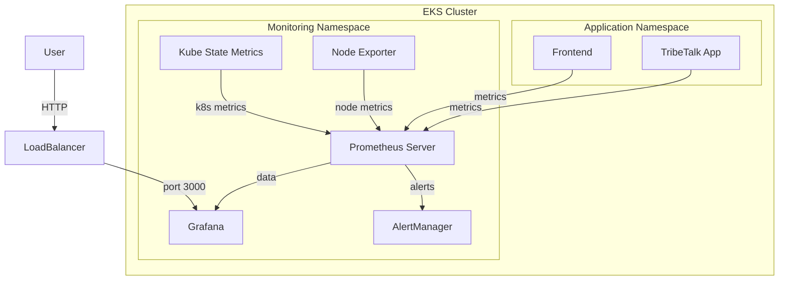

# Self-Hosted Grafana Stack on EKS - Implementation Plan

## Overview

Deploy a complete monitoring stack on your existing EKS cluster using the `kube-prometheus-stack` Helm chart. This provides Grafana, Prometheus, AlertManager, and pre-configured Kubernetes dashboards.

## Architecture



## Prerequisites

- ✅ EKS cluster running (you have this)
- ✅ kubectl configured
- ⚠️ Helm 3.x installed (need to verify)
- ⚠️ Sufficient cluster resources (2-4 GB RAM, 2-4 vCPUs)

---

## Proposed Changes

### Component 1: Helm Installation

#### Verify/Install Helm
- Check if Helm is installed locally
- Install Helm 3.x if needed (via Homebrew on macOS)

---

### Component 2: Namespace & Repository Setup

#### [NEW] `k8s/monitoring/namespace.yaml`
```yaml
apiVersion: v1
kind: Namespace
metadata:
  name: monitoring
  labels:
    name: monitoring
```

#### Helm Repository
```bash
helm repo add prometheus-community https://prometheus-community.github.io/helm-charts
helm repo update
```

---

### Component 3: Grafana Stack Configuration

#### [NEW] `k8s/monitoring/values.yaml`
Custom configuration for kube-prometheus-stack:

**Key configurations:**
- Grafana service type: LoadBalancer (for easy access)
- Prometheus retention: 15 days
- Storage: Use EBS volumes for persistence
- Resource limits: Optimized for small cluster
- ServiceMonitor: Auto-discover TribeTalk metrics

**Specific settings:**
```yaml
grafana:
  enabled: true
  adminPassword: "admin123"  # Change in production
  service:
    type: LoadBalancer
  persistence:
    enabled: true
    size: 10Gi

prometheus:
  prometheusSpec:
    retention: 15d
    storageSpec:
      volumeClaimTemplate:
        spec:
          accessModes: ["ReadWriteOnce"]
          resources:
            requests:
              storage: 20Gi
    resources:
      requests:
        memory: 2Gi
        cpu: 500m
      limits:
        memory: 4Gi
        cpu: 2000m

alertmanager:
  enabled: true
  alertmanagerSpec:
    storage:
      volumeClaimTemplate:
        spec:
          accessModes: ["ReadWriteOnce"]
          resources:
            requests:
              storage: 5Gi
```

---

### Component 4: TribeTalk Integration

#### [MODIFY] `tribetalk/pom.xml`
Add Micrometer Prometheus dependency (already exists, verify configuration):
```xml
<dependency>
    <groupId>io.micrometer</groupId>
    <artifactId>micrometer-registry-prometheus</artifactId>
</dependency>
```

#### [NEW] `k8s/monitoring/servicemonitor-tribetalk.yaml`
ServiceMonitor to scrape TribeTalk metrics:
```yaml
apiVersion: monitoring.coreos.com/v1
kind: ServiceMonitor
metadata:
  name: tribetalk-metrics
  namespace: monitoring
  labels:
    app: tribetalk
spec:
  selector:
    matchLabels:
      app: tribetalk
  endpoints:
  - port: http
    path: /actuator/prometheus
    interval: 30s
```

---

### Component 5: Access Configuration

#### Grafana LoadBalancer
- Service will auto-create AWS ELB
- Access via: `http://<grafana-lb-url>:3000`
- Default credentials: `admin / admin123`

#### Alternative: Ingress (Optional)
If you prefer using existing ALB Ingress Controller:
```yaml
grafana:
  ingress:
    enabled: true
    hosts:
      - grafana.your-domain.com
```

---

## Deployment Steps

### 1. Install Helm (if needed)
```bash
# macOS
brew install helm

# Verify
helm version
```

### 2. Add Helm Repository
```bash
helm repo add prometheus-community https://prometheus-community.github.io/helm-charts
helm repo update
```

### 3. Create Namespace
```bash
kubectl create namespace monitoring
```

### 4. Deploy Stack
```bash
helm install monitoring prometheus-community/kube-prometheus-stack \
  --namespace monitoring \
  --values k8s/monitoring/values.yaml
```

### 5. Wait for Pods
```bash
kubectl get pods -n monitoring -w
```

### 6. Get Grafana URL
```bash
kubectl get svc -n monitoring monitoring-grafana
```

### 7. Deploy TribeTalk ServiceMonitor
```bash
kubectl apply -f k8s/monitoring/servicemonitor-tribetalk.yaml
```

---

## Verification Plan

### 1. Check Pod Status
```bash
kubectl get pods -n monitoring
```

**Expected:** All pods in `Running` state

### 2. Access Grafana
- Get LoadBalancer URL
- Login with `admin / admin123`
- Verify default dashboards load

### 3. Verify Prometheus Targets
- Navigate to Prometheus UI (port-forward or LoadBalancer)
- Check `/targets` endpoint
- Verify TribeTalk endpoint is discovered

### 4. Test Metrics Collection
- Open Grafana
- Query: `up{job="tribetalk"}`
- Should return `1` if metrics are being scraped

### 5. Import Dashboards
- Import Kubernetes cluster dashboard (ID: 7249)
- Import Spring Boot dashboard (ID: 12900)
- Verify data is displayed

---

## Cost Estimation

**AWS Resources:**
- EBS volumes (35 GB total): ~$3.50/month
- LoadBalancer (Grafana): ~$16/month
- Compute (minimal overhead): ~$5/month

**Total: ~$25/month**

> **Note:** Can reduce costs by using NodePort instead of LoadBalancer and accessing via kubectl port-forward.

---

## Rollback Plan

If deployment fails or you want to remove:
```bash
# Uninstall Helm release
helm uninstall monitoring -n monitoring

# Delete namespace (removes PVCs)
kubectl delete namespace monitoring
```

---

## Next Steps After Deployment

1. **Secure Grafana**: Change default password
2. **Configure Alerts**: Set up AlertManager rules
3. **Create Dashboards**: Build custom TribeTalk dashboards
4. **Add Loki**: For log aggregation (optional)
5. **Add Tempo**: For distributed tracing (optional)
