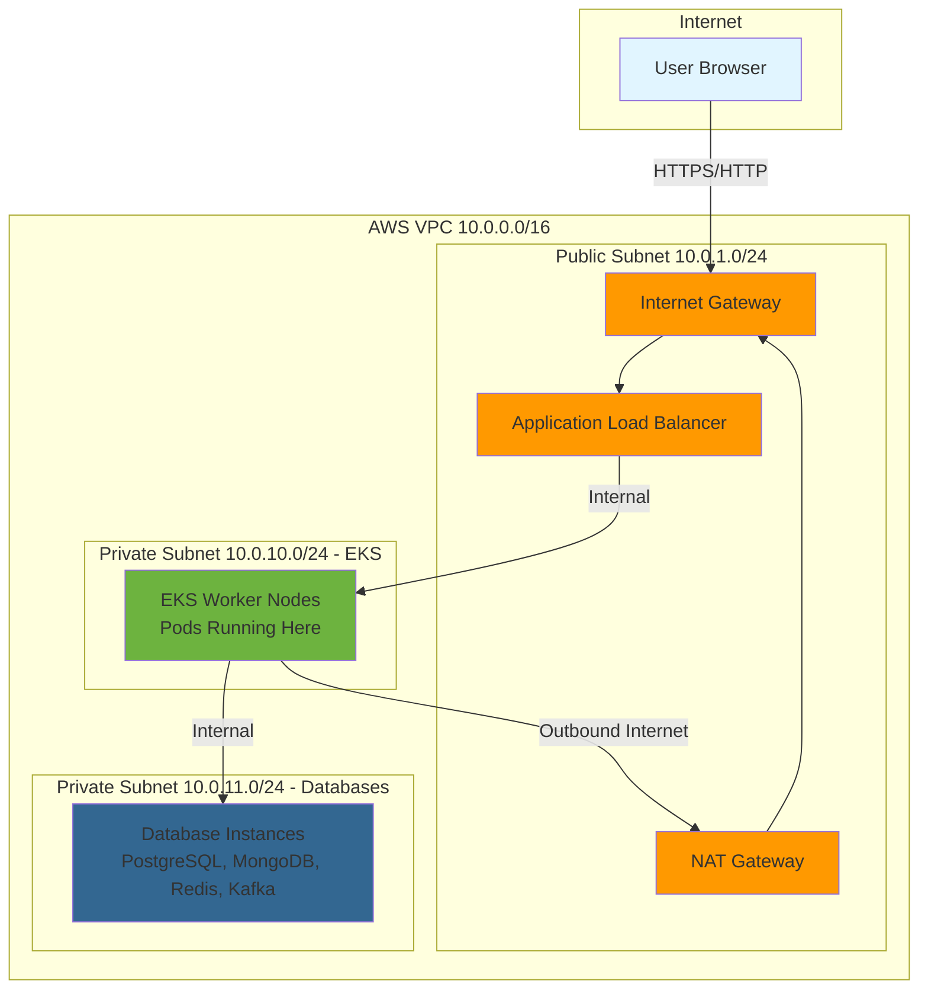
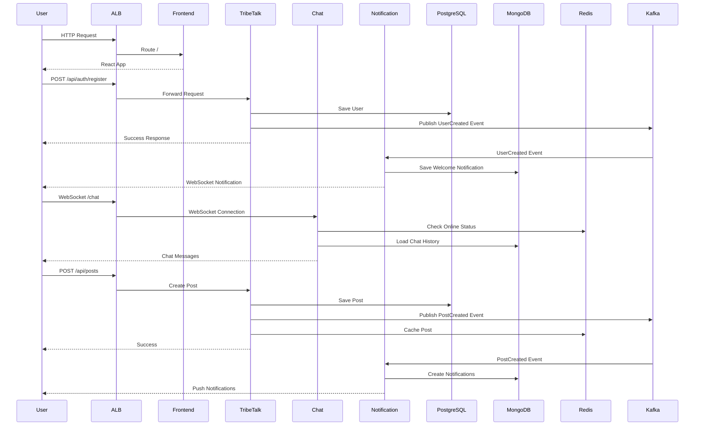
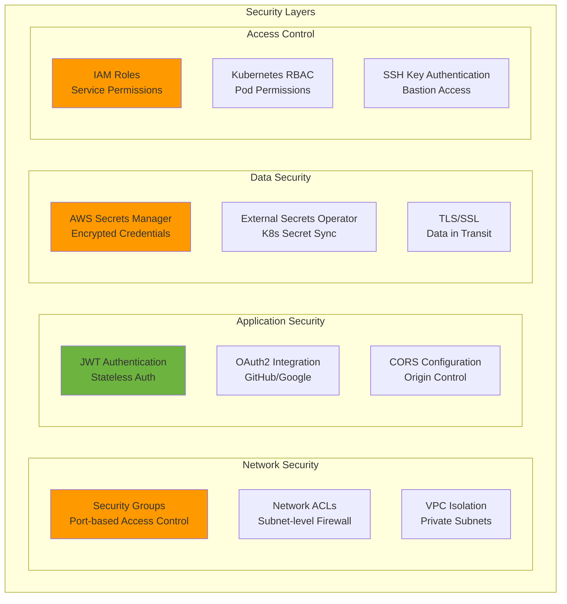
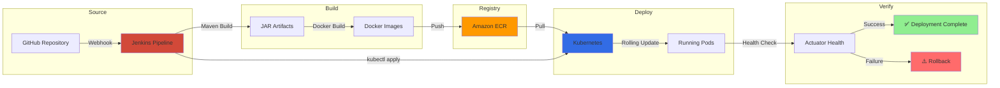
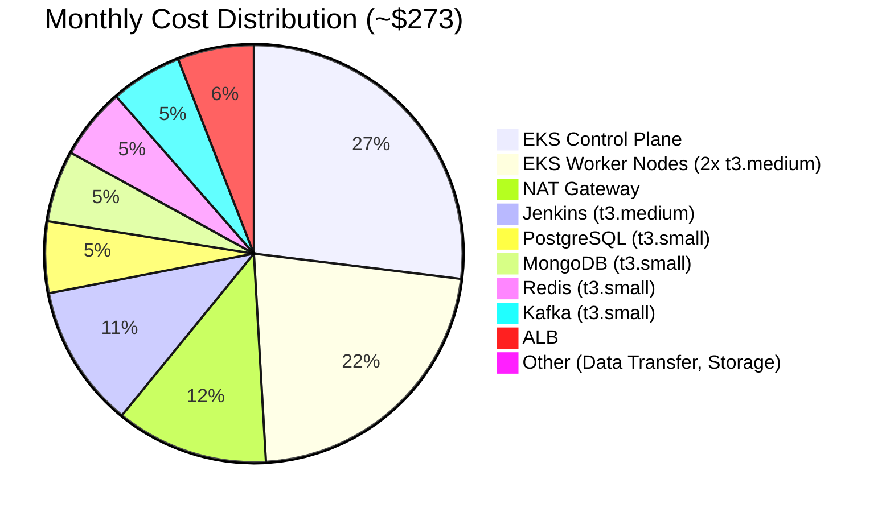

# TribeTalk Deployment Architecture

## System Architecture Diagram

```mermaid
graph TB
    subgraph "User Access"
        User[👤 User Browser]
    end
    
    subgraph "AWS Cloud - eu-north-1"
        subgraph "Public Internet"
            ALB[Application Load Balancer<br/>Port 80/443]
        end
        
        subgraph "VPC - 10.0.0.0/16"
            subgraph "Public Subnets"
                Bastion[Bastion Host<br/>SSH Access]
                Jenkins[Jenkins CI/CD<br/>Port 8080]
                NAT[NAT Gateway]
            end
            
            subgraph "Private Subnets - EKS"
                subgraph "EKS Cluster"
                    subgraph "Worker Nodes"
                        Frontend[Frontend Pods<br/>React + Nginx<br/>Port 80]
                        TribeTalk[TribeTalk Pods<br/>Spring Boot<br/>Port 8080]
                        Chat[ChatService Pods<br/>WebSocket<br/>Port 8081]
                        Notification[Notification Pods<br/>Spring Boot<br/>Port 8082]
                    end
                    
                    Ingress[Ingress Controller<br/>AWS LB Controller]
                end
            end
            
            subgraph "Private Subnets - Databases"
                PostgreSQL[(PostgreSQL<br/>Port 5432<br/>User Data)]
                MongoDB[(MongoDB<br/>Port 27017<br/>Chat/Notifications)]
                Redis[(Redis<br/>Port 6379<br/>Cache/Sessions)]
                Kafka[(Kafka<br/>Port 9092<br/>Event Streaming)]
            end
            
            subgraph "AWS Services"
                ECR[ECR<br/>Docker Images]
                SecretsManager[Secrets Manager<br/>Credentials]
                CloudWatch[CloudWatch<br/>Logs & Metrics]
            end
        end
    end
    
    User -->|HTTP/HTTPS| ALB
    ALB -->|Route /| Frontend
    ALB -->|Route /api| TribeTalk
    ALB -->|Route /chat| Chat
    ALB -->|Route /notification| Notification
    
    Frontend -.->|API Calls| TribeTalk
    Frontend -.->|WebSocket| Chat
    
    TribeTalk -->|Read/Write| PostgreSQL
    TribeTalk -->|Publish Events| Kafka
    TribeTalk -->|Cache| Redis
    
    Chat -->|Store Messages| MongoDB
    Chat -->|Subscribe Events| Kafka
    Chat -->|Cache| Redis
    
    Notification -->|Store Notifications| MongoDB
    Notification -->|Subscribe Events| Kafka
    
    Jenkins -->|Build & Push| ECR
    Jenkins -->|Deploy| Ingress
    
    Ingress -->|Manages| ALB
    
    TribeTalk -.->|Fetch Secrets| SecretsManager
    Chat -.->|Fetch Secrets| SecretsManager
    Notification -.->|Fetch Secrets| SecretsManager
    
    TribeTalk -.->|Send Logs| CloudWatch
    Chat -.->|Send Logs| CloudWatch
    Notification -.->|Send Logs| CloudWatch
    
    Bastion -.->|SSH Access| PostgreSQL
    Bastion -.->|SSH Access| MongoDB
    Bastion -.->|SSH Access| Redis
    Bastion -.->|SSH Access| Kafka
    
    style User fill:#e1f5ff
    style ALB fill:#ff9900
    style Frontend fill:#61dafb
    style TribeTalk fill:#6db33f
    style Chat fill:#6db33f
    style Notification fill:#6db33f
    style PostgreSQL fill:#336791
    style MongoDB fill:#47a248
    style Redis fill:#dc382d
    style Kafka fill:#231f20
    style ECR fill:#ff9900
    style SecretsManager fill:#ff9900
    style CloudWatch fill:#ff9900
    style Jenkins fill:#d24939
    style Bastion fill:#ff9900
```



## Deployment Flow Diagram

```mermaid
graph LR
    subgraph "Phase 1: Infrastructure"
        A1[Configure<br/>terraform.tfvars] --> A2[terraform init]
        A2 --> A3[terraform apply]
        A3 --> A4[VPC + EKS + EC2<br/>Created]
    end
    
    subgraph "Phase 2: Kubernetes"
        B1[Update<br/>kubeconfig] --> B2[Install<br/>External Secrets]
        B2 --> B3[Install<br/>ALB Controller]
        B3 --> B4[Configure<br/>Secrets Sync]
    end
    
    subgraph "Phase 3: Databases"
        C1[Run Ansible<br/>PostgreSQL] --> C2[Run Ansible<br/>MongoDB]
        C2 --> C3[Run Ansible<br/>Redis]
        C3 --> C4[Run Ansible<br/>Kafka]
    end
    
    subgraph "Phase 4: Build Images"
        D1[Build<br/>TribeTalk JAR] --> D2[Build<br/>Docker Images]
        D2 --> D3[Push to<br/>ECR]
    end
    
    subgraph "Phase 5: Deploy"
        E1[Update<br/>Deployment YAMLs] --> E2[Deploy<br/>Services]
        E2 --> E3[Deploy<br/>Ingress]
        E3 --> E4[Get ALB<br/>DNS]
    end
    
    subgraph "Phase 6: Frontend"
        F1[Rebuild Frontend<br/>with ALB DNS] --> F2[Push to<br/>ECR]
        F2 --> F3[Update<br/>Deployment]
    end
    
    subgraph "Phase 7: Verify"
        G1[Health<br/>Checks] --> G2[Test<br/>Application]
        G2 --> G3[✅ Complete]
    end
    
    A4 --> B1
    B4 --> C1
    C4 --> D1
    D3 --> E1
    E4 --> F1
    F3 --> G1
    
    style A4 fill:#90EE90
    style B4 fill:#90EE90
    style C4 fill:#90EE90
    style D3 fill:#90EE90
    style E4 fill:#90EE90
    style F3 fill:#90EE90
    style G3 fill:#FFD700
```



## Network Flow Diagram



## Data Flow Diagram



## Security Architecture



## Monitoring & Observability

```mermaid
graph LR
    subgraph "Application Metrics"
        App[Spring Boot Apps] -->|Actuator| Metrics[Prometheus Metrics]
    end
    
    subgraph "Infrastructure Metrics"
        K8s[Kubernetes] -->|Metrics API| KMetrics[Node/Pod Metrics]
        AWS[AWS Resources] -->|CloudWatch| CWMetrics[AWS Metrics]
    end
    
    subgraph "Logs"
        App -->|stdout/stderr| Logs[Container Logs]
        Logs -->|FluentBit| CloudWatch[CloudWatch Logs]
    end
    
    subgraph "Monitoring Stack"
        Metrics --> Prometheus[Prometheus]
        KMetrics --> Prometheus
        Prometheus --> Grafana[Grafana Dashboards]
        CloudWatch --> Grafana
    end
    
    subgraph "Alerting"
        Prometheus --> AlertManager[Alert Manager]
        AlertManager -->|Notifications| Slack[Slack/Email]
    end
    
    style Prometheus fill:#e6522c
    style Grafana fill:#f46800
    style CloudWatch fill:#ff9900
```

## CI/CD Pipeline



## Cost Breakdown



---

## Legend

- 🟦 **Blue**: User-facing components
- 🟧 **Orange**: AWS managed services
- 🟩 **Green**: Application services
- 🟪 **Purple**: Databases
- 🟥 **Red**: CI/CD tools

---

## Key Takeaways

1. **Multi-tier Architecture**: Frontend, Backend APIs, Databases
2. **Microservices**: TribeTalk, ChatService, Notification Service
3. **Event-Driven**: Kafka for async communication
4. **Scalable**: Kubernetes with auto-scaling
5. **Secure**: Private subnets, secrets management, IAM roles
6. **Observable**: Prometheus, Grafana, CloudWatch
7. **Automated**: Jenkins CI/CD pipeline

---

For deployment instructions, see [QUICK_START.md](./QUICK_START.md)
